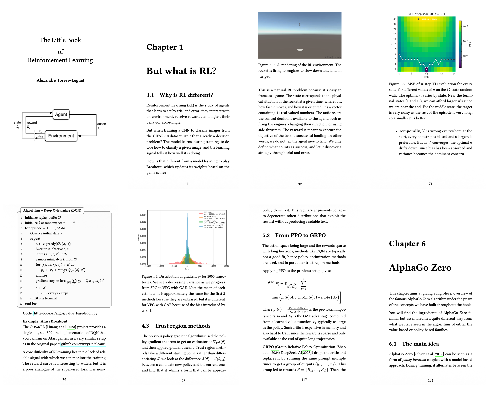

# The Little Book of Reinforcement Learning

This is the associated GitHub page of the Little Book of Reinforcement Learning.

This book is a short introduction to Reinforcement Learning, from the basics to applied algorithms.

In this repo, along with the book itself, you can find the supplementary material of the book.
More precisely:
- under the `algos/` folder, the Pytorch-based implementation of the different algorihms covered in the book, from MC to PPO.
- under the `supplementary/` folder, you can find detailed explanations and rigorous proofs for the dynamic programming algorithms briefly covered in the book. This is a document I wrote in 2021.

More material is subject to be added along the way in this repo.

You can print one for youself [here](https://www.amazon.fr/Little-Book-Reinforcement-Learning/dp/B0H3W5PJH6/ref=sr_1_1?crid=3H05NR7B52374&dib=eyJ2IjoiMSJ9.iKUkH6NQiRsFi6D8ARdAPQ.DYkU1dqtml5IBfMqGdpZBANbkpYtC4qDpIUYvxVtRJA&dib_tag=se&keywords=alexandre+torres+leguet&qid=1783721422&sprefix=alexandre+tor%2Caps%2C212&sr=8-1).

Versions of the book : 
- V1 (June 2026)

The book is distributed under a non-commercial Creative Commons license (CC BY-SA 4.0).

